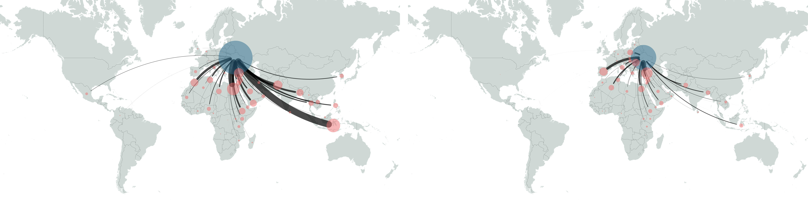

[](https://www.python.org/downloads/release/python-390/)
[](https://www.python.org/downloads/release/python-3100/)
[](https://www.python.org/downloads/release/python-3110/)
[](https://www.python.org/downloads/release/python-3110/)
[](https://www.python.org/downloads/release/python-3110/)
# Modelling Global Trade with Optimal Transport
### Data and code repository

This repository contains all the code and data required to train a neural network on FAOStat data and plot the results.
Code is presented in Jupyter notebooks and as python scripts. 
We recommend installing required packages into a virtual environment, as detailed
below. 

---
### Installation
> [!NOTE] 
> The git documentation can be found [here](https://git-scm.com).
- Clone the repository into a location of your choice using `git clone`:

    ```commandline
    git clone https://github.com/ThGaskin/inverse-optimal-transport.git
    ```
    The preferred method is to clone with SSH after having [obtained an SSH key](https://docs.github.com/en/authentication/connecting-to-github-with-ssh/adding-a-new-ssh-key-to-your-github-account)
    – this circumvents having to enter access passwords to push changes to remote.
- Create a virtual environment and install all required packages using
  ```commandline
  pip install -r requirements.txt

### Get the data from the [Huggingface repo](https://huggingface.co/datasets/ThGaskin/OT_Trade)
The datasets and trained neural networks are hosted on Huggingface. To obtain the data, we recommend using the 
[huggingface CLI](https://huggingface.co/docs/huggingface_hub/en/guides/cli) to download all the data:
```commandline
curl -LsSf https://hf.co/cli/install.sh | bash
```
Then, login using your access token:
```commandline
hf auth login
```
Finally, download the data into the `data/` folder:
```commandline
hf download ThGaskin/OT_Trade --repo-type=dataset --local-dir data
```
### Evaluation
The neural network samples for each commodity are stored in ``data/<commodity>/sample_stats.nc``. 
Use the ``Evaluate.ipynb`` notebook to evaluate the results and reproduce the publication plots. The folders in 
`data` also contain all the Gravity model estimates.

Each commodity folder contains a subfolder `trained_models`. These contain an ensemble of ten trained neural networks 
we use for sampling (see below).

### Training and plotting a model
Training a neural network is done using the ``train.py`` file, which is controlled from the ``cfg.yaml`` configuration
file. All training settings, as well as the neural network architecture, can be controlled from this configuration file.

We also illustrate the training procedure step-by-step in the ``Train.ipynb`` notebook, which demonstrates the principle,
and also shows how to load the ensemble of neural networks and use them for sampling.

Here is a documentation of the configuration file:
```yaml
# Path configuration
BASE_PATH:  "." # Set this to the directory containing this README
device: 'cpu' # Device to use for training. Can be 'cuda' or 'mps' on Apple Silicon devices
path_note: 'Soya' # Optional note added to output path
dry_run: True # Do a dry run, i.e. do not save results. Set this to 'False' to save the output to the 'Results' directory

# Settings for loading the training data
Data_loading:

  # Path to data, relative to base path
  data_path: 'data/Wheat'

  # Passed to `torch.load`
  load_args: {weights_only: True}

  # Continue training a neural network from a directory. This will overwrite the model saved in that directory, 
  # but is useful e.g. for training long runs on a cluster.
  load_from_dir: ~ 

# Neural network settings
NeuralNet:
  num_layers: 5
  nodes_per_layer:
    default: 60
  activation_funcs:
    default: tanh
    layer_specific:
      -1: sigmoid
  biases:
    default: [-1, 1]
  learning_rate: 0.002
  optimizer: Adam

# Training settings
Training:

  # Number of epochs
  N_epochs: 10

  # Number of batches after which to perform gradient descent step
  batch_size: 23

  # Frequency at which to save the neural network and loss
  write_every: 100
  
  # Kwargs for the Sinkhorn algorithm
  sinkhorn_kwargs:
    max_iter: 100 # Maximum number of iterations to use
    tolerance: 1e-5 # Tolerance criterion to terminate the algorithm
    epsilon: 0.15 # Entropy regularisation
    normalise: False # Normalise one of the scaling vectors --- can be useful for numerical stability

  # Balance of regulariser and error on the transport plan in the loss function
  eta: 1
```
### Gravity model
The gravity models presented in the article can be run using the `data/Gravity_model/gavity_equation.R` script.
The covariates are stored alongside the script in the `Covariates` folder. The estimates and parameters are stored in 
the folders for each commodity in `data/<commodity name>/gravity_estimates`. The `covariates.csv` file are the fits using
the covariate-based gravity model; the `fixed_effects.csv` are the results from the Gravity model using time-destination
and time-source fixed effects. Also given are the estimated coefficients for each.